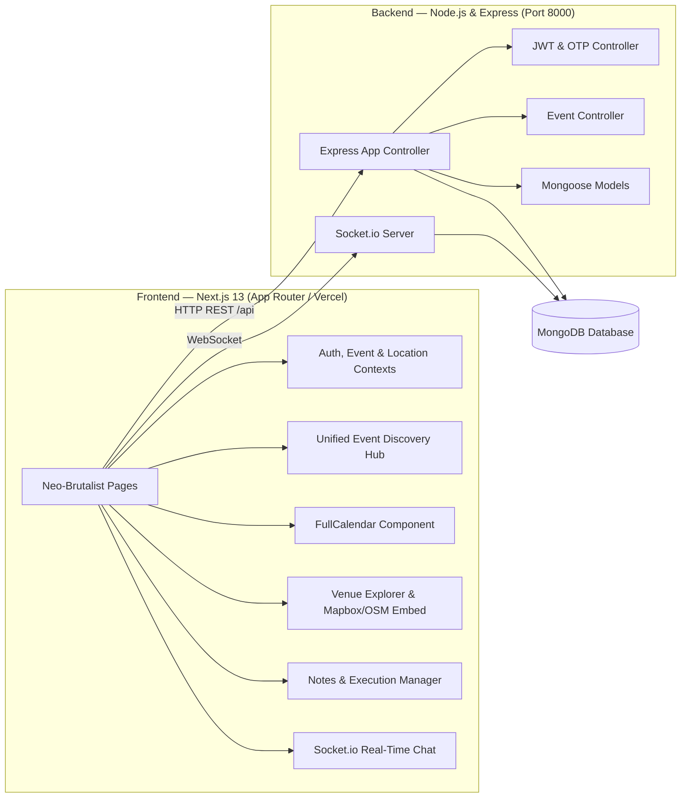

<div align="center">

# ⚡ Syncronify

**Production-Grade Event Management & Team Execution Operating System**  
Developed for **CS253: Software Development and Operations**, Indian Institute of Technology Kanpur (IIT Kanpur).

[](https://nodejs.org)
[](https://nextjs.org)
[](https://expressjs.com)
[](https://www.mongodb.com)
[](https://www.typescriptlang.org)
[](https://www.iitk.ac.in)
[](https://vercel.com)
[](LICENSE)

</div>

---

## 📖 Table of Contents

- [About & Course Context](#-about--course-context)
- [🎨 Neo-Brutalist Design Philosophy](#-neo-brutalist-design-philosophy)
- [✨ Key Features](#-key-features)
- [🏗️ System Architecture](#️-system-architecture)
- [🛠️ Tech Stack](#️-tech-stack)
- [📁 Directory Structure](#-directory-structure)
- [🚀 Local Development Setup](#-local-development-setup)
- [☁️ Vercel Deployment Guide](#️-vercel-deployment-guide)
- [📡 API Specification](#-api-specification)
- [🔐 Role-Based Access Control](#-role-based-access-control)
- [🧪 Testing & Quality Assurance](#-testing--quality-assurance)
- [🤝 Acknowledgments & Credits](#-acknowledgments--credits)
- [📄 License](#-license)

---

## 💡 About & Course Context

In academic and university ecosystems, students, campus clubs, and department councils frequently struggle with fragmented communication across messaging apps, conflicting event schedules, and unclear venue directions.

**Syncronify** is an all-in-one Event Management Platform engineered to streamline event discovery, venue navigation, personal scheduling, execution note-taking, and real-time team collaboration into a single high-contrast interface.

### 🎓 CS253 IIT Kanpur Course Context
This software system was developed as a flagship project for **CS253 (Software Development and Operations)** at the **Indian Institute of Technology Kanpur (IITK)**. It demonstrates modern full-stack web engineering, resilient state fallbacks, modular UI composition, REST API design, automated test suites, and Vercel cloud deployment readiness.

---

## 🎨 Neo-Brutalist Design Philosophy

Syncronify employs a custom **Neo-Brutalist UI** engineered for optimal contrast, instant readability, and physical tactile responsiveness:

- **Thick Solid Outlines**: Crisp 2px–4px black borders (`border-4 border-black`) outlining cards, inputs, buttons, and popups.
- **Hard Offset Shadows**: Unblurred offset box-shadows (`shadow-[4px_4px_0px_#000]`) with active translation compression effects.
- **High-Contrast Palette**: Curated accent tokens including Electric Yellow (`#FFE600`), Cyber Cyan (`#00F0FF`), Neon Pink (`#FF007A`), Lime Green (`#00FF66`), and Canvas Off-white (`#F4F4F0`).
- **Typography System**: Headlines powered by *Space Grotesk* for bold uppercase tracking, with body UI rendered in *Plus Jakarta Sans*.

---

## ✨ Key Features

### 1. ⚡ Unified Event Discovery Hub
- Browse public and campus organization events filtered by categories (*Tech & Code*, *Cultural*, *Workshop*, *Sports*, *Meetup*).
- Real-time **RSVP Toggle** with live attendee counters and confirmed attendance badges.
- Detailed modal popups containing venue maps, organizer info, schedule timings, and share options.

### 2. 📅 Interactive Schedule & Calendar
- Powered by **FullCalendar** with custom Neo-Brutalist event pill styles and day grid borders.
- Multi-view support: Month, Week, and Day grid displays with drag-and-drop event resizing.
- Quick date click trigger to draft and publish personal or organization events.

### 3. 🗺️ Interactive Venue & Map Navigation
- OpenStreetMap and Mapbox GL integrated venue finder.
- Place search auto-complete with latitude/longitude coordinate binding.
- Quick selectors for popular IIT Kanpur campus venues (Auditorium, Innovation Lab, Open Air Amphitheatre, Sports Arena).

### 4. 📝 Notes & Execution Workspace
- Full personal and team note-taking module.
- Create, edit, tag, pin, and search notes (*Event Plans*, *Speaker Agendas*, *Logistics Checklists*).
- Local storage persistence layer for offline resiliency.

### 5. 💬 Real-Time Event Chat
- Socket.io low-latency real-time chat interface.
- Multi-channel support switching between *General Community Lobby* and *Organizer Support Desk*.
- Custom speech bubbles, timestamps, and online status indicators.

---

## 🏗️ System Architecture



---

## 🛠️ Tech Stack

### Frontend
- **Framework**: Next.js 13 (React 18, TypeScript)
- **Styling**: Tailwind CSS & Neo-Brutalist Utility System (`globals.css`)
- **Calendar**: FullCalendar (daygrid, timegrid, interaction)
- **Maps & Geo**: Mapbox GL JS / OpenStreetMap Leaflet Embed
- **Icons & Animation**: React Icons, Lucide React, Framer Motion
- **Toast Notifications**: React Toastify
- **Deployment Platform**: Vercel

### Backend
- **Runtime**: Node.js 18+ & Express.js
- **Database**: MongoDB & Mongoose ODM
- **Real-Time Communication**: Socket.io
- **Security & Authentication**: JSON Web Tokens (JWT), bcryptjs password hashing, OTP verification
- **Testing**: Mocha, Chai, Supertest

---

## 📁 Directory Structure

```bash
Syncronify/
├── vercel.json                      # Vercel deployment configuration
├── client/                          # Next.js Frontend App
│   ├── public/                      # Static assets & generated logo
│   ├── vercel.json                  # Client Vercel override spec
│   └── src/
│       ├── app/                     # App Router Pages
│       │   ├── page.tsx             # Neo-Brutalist Landing Page
│       │   ├── globals.css          # Design tokens & utility classes
│       │   ├── authentication/      # Login & Signup Console
│       │   ├── dashboard/           # Member Dashboard Console
│       │   ├── admin-dashboard/     # Event Organizer Console
│       │   └── application-admin-dashboard/ # Super Admin Console
│       ├── components/              # Modular UI Components
│       │   ├── Navbar/              # Top Navbar with logo & role badges
│       │   ├── Sidebar/             # Neo-Brutalist Navigation Console
│       │   ├── Calendar/            # FullCalendar Component
│       │   ├── CreateEvent/         # Event Publishing Modal
│       │   ├── EventPage/           # Unified Event Discovery Hub
│       │   ├── Notes/               # Notes & Execution Manager
│       │   ├── MapBox/              # Interactive Venue Map
│       │   ├── Chat/                # Socket.io Real-Time Chat
│       │   ├── Carousel/            # Spotlight Event Showcase
│       │   └── Login/ & UserRegister/ # Authentication Forms
│       └── context/                 # Auth, Event, Location Context Providers
│
├── server/                          # Express + Socket.io Backend App
│   ├── src/
│   │   ├── appMain.js               # Express Application Core
│   │   ├── controllers/             # Auth & Event API Controllers
│   │   ├── models/                  # User, Event, Message Schemas
│   │   ├── routes/                  # API Route Definitions
│   │   └── middleware/              # JWT Protection & Error Handlers
│   ├── websockets-service/          # Socket.io Server logic
│   ├── test/                        # Mocha & Supertest API Test Suite
│   └── serverMain.js                # Server entry point
│
├── docker-compose.yml               # Local Infrastructure stack
├── Dockerfile                       # Backend containerization spec
├── Dockerfile.client                # Frontend containerization spec
└── package.json                     # Monorepo root scripts
```

---

## 🚀 Local Development Setup

### Prerequisites
- **Node.js**: v18.0.0 or higher
- **npm**: v8.0.0 or higher
- **MongoDB**: Local MongoDB server or Atlas connection string

### 1. Clone Repository & Install Dependencies
```bash
git clone https://github.com/its-adityajohri/Syncronify.git
cd Syncronify

# Install root, client, and server dependencies
npm run install:all
```

### 2. Environment Configuration
Create `.env` in `server/`:
```env
PORT=8000
DB_URI=mongodb://127.0.0.1:27017/syncronify
JWT_SECRET=super_secret_jwt_key_2026
CLIENT_URL=http://localhost:3000
```

Create `.env.local` in `client/`:
```env
NEXT_PUBLIC_API_URL=http://localhost:8000
NEXT_PUBLIC_MAPBOX_TOKEN=your_optional_mapbox_token
```

### 3. Launch Development Servers
```bash
# Starts Express server (port 8000) and Next.js frontend (port 3000) concurrently
npm run dev
```

Navigate to `http://localhost:3000` in your web browser.

---

## ☁️ Vercel Deployment Guide

Syncronify is pre-configured with `vercel.json` for one-click deployment directly from your GitHub repository.

### Steps to Deploy:
1. Push your latest code changes to your GitHub repository:
   ```bash
   git add .
   git commit -m "feat: complete Neo-Brutalist UI revamp & Vercel readiness"
   git push origin master
   ```
2. Log in to [Vercel](https://vercel.com) and click **Add New...** → **Project**.
3. Import your **Syncronify** GitHub repository.
4. Vercel will automatically detect Next.js settings from `vercel.json`.
5. Add Environment Variable:
   - `NEXT_PUBLIC_API_URL`: Backend API URL (e.g. `https://your-backend-api.onrender.com`)
6. Click **Deploy**!

---

## 📡 API Specification

### Auth Routes (`/api/auth`)
| Method | Endpoint | Description | Access |
|--------|----------|-------------|--------|
| `POST` | `/api/auth/register` | Register user and generate verification OTP | Public |
| `POST` | `/api/auth/verify-otp` | Verify OTP code and issue JWT token | Public |
| `POST` | `/api/auth/login` | Authenticate credentials and return role token | Public |

### Event Routes (`/api/events`)
| Method | Endpoint | Description | Access |
|--------|----------|-------------|--------|
| `GET` | `/api/events/all-posted-events` | Fetch all public organization events | Member |
| `POST` | `/api/events/create-personal-event` | Create personal member event | Member |
| `POST` | `/api/events/create-event` | Publish official organization event | Organizer |
| `GET` | `/api/events/user-events` | Fetch user events | Member |
| `GET` | `/api/events/event-details` | Fetch event details by ID | Member |

---

## 🔐 Role-Based Access Control

The platform enforces three distinct user roles with tailored interfaces:

1. **General Member (`genUser`)**:
   - Access to `/dashboard`
   - Permissions: Discover public events, RSVP, manage personal schedule, edit personal notes, browse venue maps, and participate in event chat.

2. **Event Admin (`adminUser`)**:
   - Access to `/admin-dashboard`
   - Permissions: Publish official organization events, view RSVP analytics, and manage event listings.

3. **Super Admin (`applicationAdminUser`)**:
   - Access to `/application-admin-dashboard`
   - Permissions: System health monitoring, admin directory management, and community approval workflows.

---

## 🧪 Testing & Quality Assurance

### Automated Backend Tests
Run the Mocha & Supertest test suite to verify HTTP endpoints, error handlers, and middleware:
```bash
npm --prefix server test
```

### Frontend Production Build Check
Verify clean TypeScript compilation and static bundle generation:
```bash
npm --prefix client run build
```

---

## 🤝 Acknowledgments & Credits

- Developed for **CS253: Software Development and Operations**, Department of Computer Science & Engineering, **Indian Institute of Technology Kanpur (IIT Kanpur)**.
- **Instructors & Mentors**: CS253 Teaching Team & Course Instructors.
- **Lead Contributors & Authors**: Aditya Johri & Team.

---

## 📄 License
This project is open-source software licensed under the **ISC License**.
