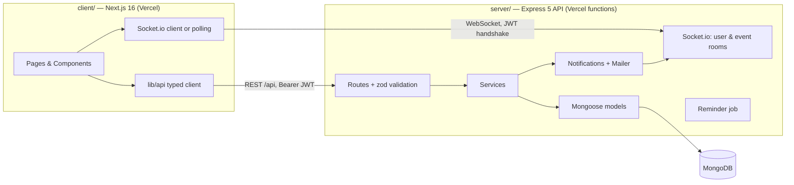

<div align="center">

# ⚡ Syncronify

**Production-Grade Event Management & Team Execution Operating System**  
Developed for **CS253: Software Development and Operations**, Indian Institute of Technology Kanpur (IIT Kanpur).

[](https://nodejs.org)
[](https://nextjs.org)
[](https://expressjs.com)
[](https://www.mongodb.com)
[](https://www.typescriptlang.org)
[](https://www.iitk.ac.in)
[](https://vercel.com)
[](LICENSE)

</div>

---

## 📖 Table of Contents

- [About & Course Context](#-about--course-context)
- [🎨 Neo-Brutalist Design Philosophy](#-neo-brutalist-design-philosophy)
- [✨ Key Features](#-key-features)
- [🏗️ System Architecture](#️-system-architecture)
- [🛠️ Tech Stack](#️-tech-stack)
- [📁 Directory Structure](#-directory-structure)
- [🚀 Local Development Setup](#-local-development-setup)
- [☁️ Deployment](#️-deployment)
- [📡 API Specification](#-api-specification)
- [🔐 Roles](#-roles)
- [🧪 Testing & Quality Assurance](#-testing--quality-assurance)
- [🤝 Acknowledgments & Credits](#-acknowledgments--credits)
- [📄 License](#-license)

---

## 💡 About & Course Context

In academic and university ecosystems, students, campus clubs, and department councils frequently struggle with fragmented communication across messaging apps, conflicting event schedules, and unclear venue directions.

**Syncronify** is an all-in-one Event Management Platform engineered to streamline event discovery, venue navigation, personal scheduling, execution note-taking, and real-time team collaboration into a single high-contrast interface.

### 🎓 CS253 IIT Kanpur Course Context
This software system was developed as a flagship project for **CS253 (Software Development and Operations)** at the **Indian Institute of Technology Kanpur (IITK)**. It demonstrates modern full-stack web engineering, resilient state fallbacks, modular UI composition, REST API design, automated test suites, and Vercel cloud deployment readiness.

---

## 🎨 Neo-Brutalist Design Philosophy

Syncronify employs a custom **Neo-Brutalist UI** engineered for optimal contrast, instant readability, and physical tactile responsiveness:

- **Thick Solid Outlines**: Crisp 2px–4px black borders (`border-4 border-black`) outlining cards, inputs, buttons, and popups.
- **Hard Offset Shadows**: Unblurred offset box-shadows (`shadow-[4px_4px_0px_#000]`) with active translation compression effects.
- **High-Contrast Palette**: Curated accent tokens including Electric Yellow (`#FFE600`), Cyber Cyan (`#00F0FF`), Neon Pink (`#FF007A`), Lime Green (`#00FF66`), and Canvas Off-white (`#F4F4F0`).
- **Typography System**: Headlines powered by *Space Grotesk* for bold uppercase tracking, with body UI rendered in *Plus Jakarta Sans*.

---

## ✨ Key Features

### 1. ⚡ Event Discovery & RSVP
- Search and filter upcoming public events by category, and sort by soonest, most popular or newest.
- One-click **RSVP** with capacity limits and an automatic **waitlist**. When someone leaves, the next person moves up and is notified.
- **Picked for you** recommendations based on the interests in your profile, plus an **Up next** strip of your own upcoming events.
- Shareable event pages (`/events/:id`) with **Add to calendar** (`.ics`), directions and share.

### 2. 📅 My Schedule
- FullCalendar view of everything you're attending, organizing, waitlisted for or planning privately, colour-coded.
- Click a day to plan a personal event on it.

### 3. 💬 Event Discussions & Announcements
- Every public event has a real-time chat (Socket.io) for the organizer and registered attendees, with a typing indicator and message history.
- Organizers can post **announcements**, which also notify every attendee in-app and by email.

### 4. 🔔 Notifications & Reminders
- Live notification bell for event changes, cancellations, waitlist promotions, announcements and organizer approvals.
- Automatic **reminder** to confirmed attendees within 24 hours of an event, in-app and by email (respecting each user's email preference).

### 5. 🎟️ Organizer Console
- Publish, edit, save as draft, cancel (attendees are notified with your message) or delete events.
- Dashboard stats: upcoming events, registrations, waitlists and attendance rate.
- Attendee list per event with one-click **check-in** and **CSV export**.

### 6. 🛡️ Super Admin Console
- Platform stats, user directory (search, filter, change role, suspend/reinstate).
- Review queue for **organizer applications**: members apply from their profile and admins approve or decline with a note.

### 7. 📝 Notes & 🗺️ Venue Map
- Notes stored on the server (search, tags, pinning), optionally linked to an event.
- Venue map of every location with upcoming events and what's on there, plus free place search (OpenStreetMap, no API key) used when creating events.

---

## 🏗️ System Architecture


```mermaid
flowchart LR
    subgraph Frontend["client/ — Next.js 16 (Vercel)"]
        UI[Pages & Components] --> APIC[lib/api typed client]
        UI --> RT[Socket.io client or polling]
    end

    subgraph Backend["server/ — Express 5 API (Vercel functions)"]
        R[Routes + zod validation] --> S[Services]
        S --> M[Mongoose models]
        S --> N[Notifications + Mailer]
        WS[Socket.io: user & event rooms]
        J[Reminder job]
    end

    APIC -->|REST /api, Bearer JWT| R
    RT -->|WebSocket, JWT handshake| WS
    M --> DB[(MongoDB)]
    N --> WS
```

---

## 🛠️ Tech Stack

### Frontend
- **Framework**: Next.js 16 (App Router, React 19, TypeScript)
- **Styling**: Tailwind CSS & Neo-Brutalist component classes (`globals.css`)
- **Data**: typed API client in `src/lib/api` (axios), realtime via `socket.io-client`
- **Calendar**: FullCalendar · **Maps**: OpenStreetMap (embed + place search via the API) · **Toasts**: React Toastify

### Backend
- **Runtime**: Node.js 20+ & Express 5
- **Database**: MongoDB with Mongoose 8
- **Validation**: zod (friendly field-level errors)
- **Auth**: JWT bearer tokens, bcrypt, email verification codes, password reset links
- **Realtime**: Socket.io (JWT-authenticated)
- **Security**: helmet, CORS allow-list, rate limiting on auth endpoints
- **Email**: Nodemailer over any SMTP provider (e.g. Brevo)
- **Testing**: Node's built-in test runner, Supertest and an in-memory MongoDB

---

## 📁 Directory Structure

```bash
Syncronify/
├── client/                      # Next.js web app
│   └── src/
│       ├── app/                 # Routes: /, /authentication, /reset-password, /events/[id],
│       │                        #   /dashboard (members), /admin-dashboard (organizers),
│       │                        #   /application-admin-dashboard (super admins)
│       ├── components/          # UI components (Auth, EventPage, Chat, Calendar, Profile, ...)
│       ├── context/             # AuthContext (session + socket), EventContext, LocationContext
│       └── lib/
│           ├── api/             # Typed API client and response types
│           ├── format.ts        # Dates, labels, role routing
│           └── realtime.ts      # Socket connection
│
├── server/                      # Express API
│   ├── src/
│   │   ├── app.js               # Express app (middleware + routes)
│   │   ├── server.js            # Entry point: DB, HTTP, sockets, jobs, graceful shutdown
│   │   ├── config/              # Validated env + DB connection
│   │   ├── models/              # User, Event, Registration, Note, Message, Notification, OrganizerApplication
│   │   ├── modules/             # Feature modules: auth, me, events, chat, notes, notifications, organizer, admin
│   │   │                        #   each with *.routes.js (HTTP) and *.service.js (logic)
│   │   ├── middleware/          # auth, validate, rate limits, error handler
│   │   ├── sockets/             # Socket.io server
│   │   ├── jobs/                # Event reminders
│   │   └── lib/                 # errors, tokens, mailer, email templates, ics, logger
│   ├── scripts/                 # seed, create-admin, dev-memory
│   ├── api/index.js             # Vercel serverless entry
│   └── test/                    # API test suite
```

---

## 🚀 Local Development Setup

### Prerequisites
- **Node.js** 20.19 or newer (tested on 22 and 26)
- **MongoDB** is optional locally: `npm run dev:memory` runs a built-in database. Production uses MongoDB Atlas.

### 1. Install
```bash
git clone https://github.com/its-adityajohri/Syncronify.git
cd Syncronify
npm run install:all
```

### 2. Configure
```bash
cp server/.env.example server/.env        # set DB_URI, JWT_SECRET, CLIENT_URL
cp client/.env.example client/.env         # set NEXT_PUBLIC_API_URL=http://localhost:4000
```
Without SMTP settings, development still works: verification codes are shown in the app and emails are printed in the server log.

### 3. Run
```bash
# Option A: you have MongoDB
npm --prefix server run seed      # demo data (optional)
npm run dev                       # API on :4000, web app on :3000

# Option B: no MongoDB installed (persistent local DB in server/.data, auto-seeded)
npm run dev:memory
```
Open the URL the `[web]` line prints (usually http://localhost:3000; if that port is busy Next.js picks 3001, and the API accepts any localhost port in development). The first `dev:memory` run downloads a local MongoDB binary (~780 MB) once; later runs start in seconds. Delete `server/.data` to start over with fresh demo data.

### Demo accounts (from the seed script)
All use the password `syncronify123`: `member@syncronify.dev`, `organizer@syncronify.dev`, `admin@syncronify.dev`, plus `asha@` (has a pending organizer application) and `rahul@`. Set `NEXT_PUBLIC_SHOW_DEMO_ACCOUNTS=true` to show one-click buttons on the sign-in page.

### First real admin
Nobody can sign up as an admin. Create or promote one with:
```bash
npm --prefix server run create-admin -- --email you@example.com --name "Your Name" --password "a-strong-password"
```

---

## ☁️ Deployment

Both apps run on **Vercel** (team `sak-16a5`) with **MongoDB Atlas** as the database.

| Piece | Vercel project | Root | URL |
|-------|----------------|------|-----|
| Web app | `syncronify` | `client/` | https://syncronify-self.vercel.app |
| API | `syncronify-api` | `server/` | https://syncronify-api.vercel.app |

How the API runs on Vercel:
- `server/api/index.js` is the serverless entry; `server/vercel.json` routes every path to it.
- Vercel functions can't hold WebSockets, so the API reports `realtime: "polling"` at `/api/meta` and the web app polls for chat (every 4 s) and notifications (every 30 s). Locally it uses Socket.io for instant updates.
- Event reminders run daily via **Vercel Cron** (`/api/jobs/event-reminders`, authenticated with `CRON_SECRET`).

**API environment variables:** `DB_URI`, `JWT_SECRET`, `CRON_SECRET`, `CLIENT_URL` (comma-separated; `*` wildcards allow preview deployments, e.g. `https://syncronify-*-sak-16a5.vercel.app`), `TRUST_PROXY=1`, plus SMTP settings for email.
**Web app environment variables:** `NEXT_PUBLIC_API_URL`, optionally `NEXT_PUBLIC_SHOW_DEMO_ACCOUNTS`.

Deploy manually with `vercel deploy --prod` from `server/` or `client/`; the web app also deploys on every push to `master`.

---

## 📡 API Specification

All endpoints are under `/api`. Successful responses are `{ "data": ... }` (lists add `"meta"` for pagination). Errors are `{ "error": { "code", "message", "details"? } }`. Authenticated endpoints need `Authorization: Bearer <token>`.

| Area | Endpoints |
|------|-----------|
| Health | `GET /health` |
| Auth | `POST /auth/register`, `/auth/verify-email`, `/auth/resend-verification`, `/auth/login`, `/auth/forgot-password`, `/auth/reset-password` |
| Me | `GET/PATCH /me`, `POST /me/password`, `GET /me/calendar?from&to`, `GET /me/registrations` |
| Events | `GET /events` (`q, category, sort, page, limit, ...`), `GET /events/recommended`, `GET /events/venues`, `GET /events/:id`, `GET /events/:id/calendar.ics`, `POST /events`, `PATCH /events/:id`, `POST /events/:id/cancel`, `DELETE /events/:id` |
| Registration | `POST/DELETE /events/:id/registration`, `GET /events/:id/attendees`, `PUT /events/:id/attendees/:userId/check-in` |
| Chat | `GET/POST /events/:id/messages` |
| Notes | `GET/POST /notes`, `PATCH/DELETE /notes/:id` |
| Places | `GET /places/search?q=` (venue search, signed-in users) |
| Notifications | `GET /notifications`, `POST /notifications/:id/read`, `POST /notifications/read-all` |
| Organizer | `POST /organizer/applications`, `GET /organizer/applications/latest`, `GET /organizer/overview` |
| Admin | `GET /admin/stats`, `GET /admin/users`, `PATCH /admin/users/:id`, `GET /admin/organizer-applications`, `POST /admin/organizer-applications/:id/approve` \| `/reject` |

**Socket.io** (connect with `auth: { token }`): the server pushes `notification:new` and `message:new`/`event:typing` for rooms joined with `event:join`.

---

## 🔐 Roles

| Role | How you get it | Can do |
|------|----------------|--------|
| **Member** | Sign up | Discover and RSVP to events, personal calendar entries, notes, event chats, apply to become an organizer |
| **Organizer** | Application approved by an admin | Everything a member can, plus publish/manage public events, attendees, check-in and announcements |
| **Super Admin** | `create-admin` script or promoted by another admin | Everything above, plus user management, organizer approvals and moderation of public events |

Private (personal) events are visible only to their owner, including to admins.

---

## 🧪 Testing & Quality Assurance

```bash
npm --prefix server test            # 78 API tests against an in-memory MongoDB
npm --prefix client run build       # type-checks and builds the web app
```
The API tests cover auth flows (verification, lockout, reset, suspension), visibility rules, concurrent registration (no overselling), waitlist promotion, notifications, reminders, chat permissions, admin workflows and realtime delivery.

---

## 🤝 Acknowledgments & Credits

- Developed for **CS253: Software Development and Operations**, Department of Computer Science & Engineering, **Indian Institute of Technology Kanpur (IIT Kanpur)**.
- **Instructors & Mentors**: CS253 Teaching Team & Course Instructors.
- **Lead Contributors & Authors**: Aditya Johri & Team.

---

## 📄 License
This project is open-source software licensed under the **ISC License**.
