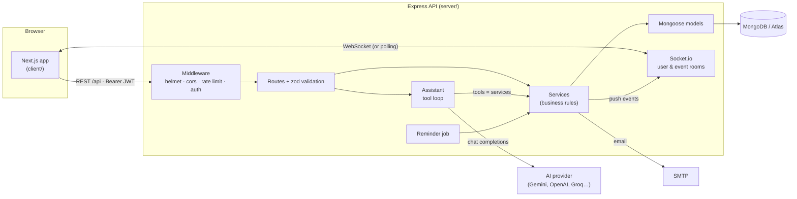
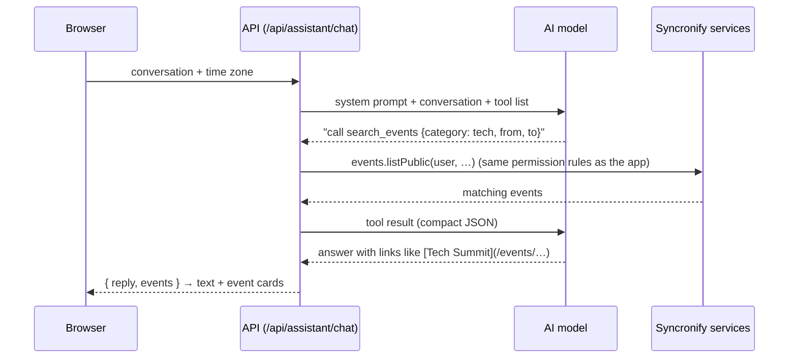
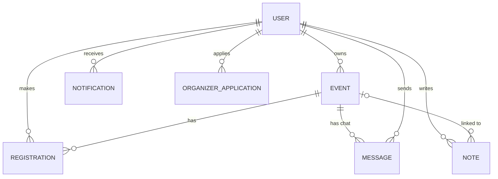

<div align="center">

# Syncronify

**The campus event platform: discover events, RSVP, plan your week, chat with attendees, and ask an AI assistant what's on.**

[](https://nextjs.org)
[](https://react.dev)
[](https://www.typescriptlang.org)
[](https://expressjs.com)
[](https://www.mongodb.com)
[](https://socket.io)
[](https://syncronify-self.vercel.app)
[](#testing)

**[Live app](https://syncronify-self.vercel.app)** · **[API health](https://syncronify-api.vercel.app/api/health)** · Built for CS253, IIT Kanpur

</div>

---

## Contents

1. [What is Syncronify?](#what-is-syncronify)
2. [Features](#features)
3. [Tech stack](#tech-stack)
4. [How it works](#how-it-works)
5. [Project structure](#project-structure)
6. [Getting started](#getting-started)
7. [Configuration](#configuration)
8. [Scripts](#scripts)
9. [The AI assistant](#the-ai-assistant)
10. [Data model](#data-model)
11. [API reference](#api-reference)
12. [Roles and permissions](#roles-and-permissions)
13. [Security](#security)
14. [Testing](#testing)
15. [Deployment](#deployment)
16. [Troubleshooting](#troubleshooting)
17. [Adding a feature](#adding-a-feature)
18. [Credits and license](#credits-and-license)

---

## What is Syncronify?

On a university campus, events are announced across WhatsApp groups, posters, emails and Instagram. Students miss things, clubs double-book venues, and nobody knows how many people will actually show up.

**Syncronify puts all of it in one place.** Clubs publish events; students find them, RSVP, add them to their calendar and chat with other attendees; and admins keep the platform tidy. An AI assistant answers questions like *"what's happening this weekend?"* using the real data.

| Who | What they get |
| --- | --- |
| **Students (members)** | One feed of campus events, one-tap RSVP with waitlists, a personal calendar, notes, event chats, reminders, and an AI assistant. |
| **Clubs (organizers)** | Publish and manage events, see registrations and waitlists, check people in at the door, export attendee lists, post announcements. |
| **Admins** | Approve which clubs can publish, manage users, moderate public events. |

**Course context.** Syncronify was developed as a project for **CS253: Software Development and Operations** at the **Indian Institute of Technology Kanpur (IIT Kanpur)**. It demonstrates full-stack web engineering: a typed REST API, real-time features, automated tests and cloud deployment.

---

## Features

### Discover and RSVP
- Search and filter upcoming public events by keyword and category; sort by soonest, most popular or newest.
- **One-tap RSVP** with capacity limits and an automatic **waitlist**. When someone cancels, the next person on the waitlist is moved up and notified. Two people can never take the last seat at the same time (the seat check is a single atomic database update).
- **Picked for you** recommendations from the interests in your profile, and a **Your tickets** row of your upcoming events.
- Shareable event pages with **Add to calendar** (`.ics` file), map, directions and share.

### Plan
- **My schedule:** a calendar (day, week and month views) of everything you're attending, organising, waitlisted for, or planning privately. Click a day to add a personal plan.
- **Notes:** searchable, taggable, pinnable notes, optionally linked to an event.
- **Venue map:** every location with upcoming events, and what's on there.

### Stay in the loop
- **Event chat** for each public event, between the organizer and registered attendees, with a typing indicator.
- **Announcements** from organizers, delivered in-app and by email.
- **Notifications** for event changes, cancellations, waitlist promotions and organizer approvals, plus an automatic **reminder** within 24 hours of each event you're going to.

### Ask Sync (AI assistant)
- A chat panel (header button or <kbd>Ctrl</kbd>/<kbd>⌘</kbd>+<kbd>J</kbd>) that answers questions about events and your own schedule, for example *"Any tech events this weekend?"* or *"Am I free Friday evening?"*.
- Answers come from real Syncronify data, looked up with the same permission checks as the rest of the app, and include tappable event cards. It also helps with general questions (writing an event description, planning).
- Works with free AI providers. See [The AI assistant](#the-ai-assistant).

### Run events (organizers)
- Create, edit, save as draft, cancel (attendees are notified with your message) or delete events. Venue search uses OpenStreetMap (free, no key).
- Dashboard: upcoming events, registrations, waitlists, attendance rate.
- Attendee list per event with **check-in** and **CSV export**.

### Moderate (admins)
- Platform stats; user directory with search, role changes and suspension.
- Review queue for **organizer applications**: members apply from their profile, admins approve or decline with a note.

### Everywhere
- Accounts with **email verification** and **password reset**.
- **Command palette** (<kbd>Ctrl</kbd>/<kbd>⌘</kbd>+<kbd>K</kbd>) to search events and jump anywhere.
- Dark and light themes, built for phones first (every page works from 360px wide).

---

## Tech stack

Everything is TypeScript: the web app and the API.

### Frontend (`client/`)

| Technology | What it does here |
| --- | --- |
| [Next.js 16](https://nextjs.org) (App Router) + [React 19](https://react.dev) | Pages and routing (folders are URLs), layouts, production builds. |
| [TypeScript](https://www.typescriptlang.org) | Types for every API response (`src/lib/api/types.ts`), so mistakes show up in the editor. |
| [Tailwind CSS v4](https://tailwindcss.com) | Styling with utility classes; colours are design tokens in `src/app/globals.css`, so both themes come from one set of components. |
| [axios](https://axios-http.com) | HTTP client with interceptors that attach the login token and turn every failure into one `ApiError` type. |
| [socket.io-client](https://socket.io) | Live chat and notifications (falls back to polling on serverless hosts). |
| [Motion](https://motion.dev), [Lucide](https://lucide.dev), [Sonner](https://sonner.emilkowal.ski), [FullCalendar](https://fullcalendar.io), [next-themes](https://github.com/pacocoursey/next-themes) | Animation, icons, toasts, the schedule calendar, dark/light mode. |

### Backend (`server/`)

| Technology | What it does here |
| --- | --- |
| [Node.js](https://nodejs.org) 20.19+ + [Express 5](https://expressjs.com) | The HTTP API. Express 5 forwards errors thrown in `async` handlers to one error handler. |
| [TypeScript](https://www.typescriptlang.org) + [tsx](https://tsx.is) | Strict types across the API; `tsx` runs TypeScript directly in development and tests, `tsc` compiles it for production. |
| [MongoDB](https://www.mongodb.com) + [Mongoose 8](https://mongoosejs.com) | Database and models (schemas, indexes, validation). [MongoDB Atlas](https://www.mongodb.com/atlas) in production. |
| [zod 4](https://zod.dev) | Validates every request and the environment; also generates the JSON Schemas for the AI assistant's tools. |
| [jsonwebtoken](https://github.com/auth0/node-jsonwebtoken) + [bcryptjs](https://github.com/dcodeIO/bcrypt.js) | Login tokens (JWT) and password hashing. |
| [Socket.io 4](https://socket.io) | Real-time push (chat messages, typing, notifications), authenticated with the same JWT. |
| [Nodemailer](https://nodemailer.com) | Email over any SMTP provider (e.g. Brevo's free tier). |
| [helmet](https://helmetjs.github.io), [cors](https://github.com/expressjs/cors), [express-rate-limit](https://express-rate-limit.mintlify.app) | Security headers, an origin allow-list, and rate limits. |
| [pino](https://getpino.io) | Structured logging (pretty in development). |
| Any OpenAI-compatible AI API (default: [Google Gemini](https://ai.google.dev), free tier) | Powers the assistant through a small `fetch`-based client; no SDK needed. |

### Testing and hosting

| Technology | What it does here |
| --- | --- |
| Node's built-in test runner + [Supertest](https://github.com/ladjs/supertest) + [mongodb-memory-server](https://github.com/typegoose/mongodb-memory-server) | 87 API tests against a real, throwaway MongoDB. |
| [Vercel](https://vercel.com) | Hosts the web app and runs the API as a serverless function, plus a daily cron job for reminders. |
| [OpenStreetMap](https://www.openstreetmap.org) / Nominatim | Maps and venue search, free and keyless. |

---

## How it works

### Architecture


```mermaid
flowchart LR
    subgraph Browser
        UI["Next.js app<br/>(client/)"]
    end

    subgraph API["Express API (server/)"]
        MW["Middleware<br/>helmet · cors · rate limit · auth"]
        RT["Routes + zod validation"]
        SV["Services<br/>(business rules)"]
        MD["Mongoose models"]
        WS["Socket.io<br/>user & event rooms"]
        AI["Assistant<br/>tool loop"]
        JOB["Reminder job"]
    end

    UI -- "REST /api · Bearer JWT" --> MW --> RT --> SV --> MD --> DB[(MongoDB / Atlas)]
    UI <-->|"WebSocket (or polling)"| WS
    SV -- "push events" --> WS
    RT --> AI -- "tools = services" --> SV
    AI -- "chat completions" --> LLM["AI provider<br/>(Gemini, OpenAI, Groq…)"]
    SV -- "email" --> SMTP["SMTP"]
    JOB --> SV
```

The web app and the API are **two separate programs** that talk over HTTP. You can deploy, scale or replace either one on its own.

### Life of a request

Here is what happens when a student taps **RSVP**:

1. **Browser.** `RsvpButton` calls `eventsApi.register(id)` from `client/src/lib/api`. The axios client adds `Authorization: Bearer <token>` and sends `POST /api/events/:id/registration`.
2. **Middleware** (`server/src/app.ts`). `helmet` sets security headers, `cors` checks the origin, `pino-http` logs the request, `express.json()` parses the body, and the rate limiter counts it.
3. **Authentication** (`middleware/auth.ts`). `authenticate` verifies the JWT, loads the user, and rejects tokens issued before a password change or belonging to a suspended account. The user is put on `req.user`.
4. **Validation** (`middleware/validate.ts`). The route's zod schema checks `params` (a valid id). Invalid input becomes a `400` with field-by-field messages; valid input reaches the handler already typed.
5. **Service** (`modules/events/registrations.service.ts`). The business rule: is registration open? Is this the organizer? Then it atomically claims a seat (`attendeeCount < capacity` and the increment happen in one update) or adds you to the waitlist.
6. **Database.** Mongoose writes a `Registration` document; a unique index guarantees one registration per person per event.
7. **Response.** The handler replies `{ "data": <event with your registration status> }`. If anything throws, the central `errorHandler` replies `{ "error": { "code", "message" } }` instead.
8. **Browser.** The button updates, and confetti plays.

Every endpoint follows this same path, which keeps each one short and predictable.

### Real-time updates

- **Long-running servers (local, Render, Docker):** Socket.io keeps a WebSocket open. Users join a personal room for notifications and an event room for each chat they open. Clients *send* messages over REST (one place for validation and permissions) and *receive* them over the socket.
- **Serverless (Vercel):** functions can't hold WebSockets, so `GET /api/meta` reports `realtime: "polling"` and the web app polls instead (chat every 4 s, notifications every 30 s).

The same Express app runs in both modes: `src/server.ts` starts a long-running server with sockets and a reminder timer, and `api/index.ts` wraps the app as a Vercel function.

### Frontend structure

- **Routing:** `client/src/app` uses Next.js folders-as-URLs. The `(app)` route group holds every signed-in page; its `layout.tsx` wraps them all in `RequireAuth` and the `AppShell` (header, dock, command palette, AI assistant).
- **State:** `AuthContext` holds the session, server capabilities (`/api/meta`) and the socket; `EventContext` shares event updates between pages.
- **Design system:** `client/src/components/ui` (Button, Field, Card, Dialog, Popover, Tabs…) uses semantic colour tokens (`bg-surface`, `text-muted`, `bg-primary`), so the whole look is changed in `globals.css`.

---

## Project structure

```text
Syncronify/
├── package.json              # Root scripts: install everything, run both apps together
├── client/                   # Web app (Next.js + React + TypeScript)
│   └── src/
│       ├── app/              # Pages. Public: /, /authentication, /reset-password, /events/[id]
│       │   └── (app)/        # Signed-in: /dashboard, /explore, /schedule, /chat, /notes, /map,
│       │                     #   /settings, /organizer (+ /organizer/events/[id]), /admin
│       ├── components/       # ui/ (design system), shell/, assistant/, events/, chat/, organizer/, admin/…
│       ├── context/          # AuthContext (session, capabilities, socket), EventContext
│       └── lib/
│           ├── api/          # Typed API client (client.ts), endpoints (index.ts), types (types.ts)
│           ├── format.ts     # Dates, labels, category colours
│           └── realtime.ts   # Socket connection
│
└── server/                   # API (Express + TypeScript)
    ├── src/
    │   ├── server.ts         # Long-running entry: DB, HTTP, Socket.io, reminder timer, graceful shutdown
    │   ├── app.ts            # The Express app: middleware + routes (shared by every host)
    │   ├── config/           # env.ts (validated settings), db.ts (MongoDB connection)
    │   ├── models/           # User, Event, Registration, Note, Message, Notification, OrganizerApplication
    │   ├── modules/          # One folder per feature: auth, me, events, chat, notes, notifications,
    │   │                     #   organizer, admin, places, jobs, assistant
    │   ├── middleware/       # auth, validate, rate limits, error handler
    │   ├── sockets/          # Socket.io server
    │   ├── jobs/             # Event reminders
    │   ├── lib/              # errors, tokens, mailer, email templates, ics, logger, ai client, realtime
    │   └── types/            # Express type extensions (req.user)
    ├── api/index.ts          # Vercel serverless entry
    ├── scripts/              # dev-memory (local DB), seed (demo data), create-admin
    ├── test/                 # API test suite
    ├── vercel.json           # Rewrites everything to api/index.ts; daily cron
    ├── tsconfig.json         # Strict type-checking (app, scripts, Vercel entry)
    └── tsconfig.build.json   # Compiles src/ to dist/ for `npm start`
```

Each feature module in `server/src/modules/<feature>/` follows the same pattern:

| File | Responsibility |
| --- | --- |
| `<feature>.routes.ts` | URLs only: which middleware runs, which schema validates, which service is called. |
| `<feature>.schemas.ts` | zod schemas for the input (and the TypeScript types inferred from them). |
| `<feature>.service.ts` | Business logic and database queries. No HTTP details. |
| `<feature>.policy.ts` | Who may see or change what (events only). |

---

## Getting started

### Prerequisites

- **Node.js 20.19 or newer** (tested on 22 and 26) and npm.
- **MongoDB is optional locally.** `npm run dev:memory` downloads and runs a private MongoDB for you. To use your own, install MongoDB or create a free [Atlas](https://www.mongodb.com/atlas) cluster.

### 1. Install

```bash
git clone https://github.com/sakshamm21/syncronify.git
cd syncronify
npm run install:all        # installs root, server and client dependencies
```

### 2. Configure

```bash
cp server/.env.example server/.env
cp client/.env.example client/.env
```

The defaults work for local development. Optionally:
- Add an `AI_API_KEY` to `server/.env` to turn on the assistant ([free key, 1 minute](#turn-it-on-free)).
- Add SMTP settings to send real emails. Without them, verification codes are shown in the app and emails are printed in the server log.

### 3. Run

```bash
# No MongoDB installed: built-in database, kept in server/.data, seeded with demo data on first run
npm run dev:memory

# Or, with your own MongoDB (DB_URI in server/.env)
npm --prefix server run seed     # optional demo data
npm run dev
```

The API starts on **http://localhost:4000** and the web app on **http://localhost:3000**. If port 3000 is busy, Next.js picks 3001; the API accepts any `localhost` port in development.

The first `dev:memory` run downloads a MongoDB binary (about 780 MB) once. Delete `server/.data` to start over with fresh demo data.

### Demo accounts

Every seeded account uses the password **`syncronify123`**:

| Email | Role |
| --- | --- |
| `member@syncronify.dev` | Member |
| `organizer@syncronify.dev` | Organizer (Tech & Computing Society) |
| `cultural@syncronify.dev` | Organizer (Cultural Affairs Council) |
| `admin@syncronify.dev` | Admin |
| `asha@syncronify.dev` | Member with a pending organizer application |
| `rahul@syncronify.dev` | Member |

Set `NEXT_PUBLIC_SHOW_DEMO_ACCOUNTS=true` in `client/.env` for one-click sign-in buttons.

### Creating the first real admin

Nobody can sign up as an admin. Create one, or promote an existing account, from the command line:

```bash
npm --prefix server run create-admin -- --email you@example.com --name "Your Name" --password "a-strong-password"
```

---

## Configuration

All settings are environment variables. The API validates them at startup and refuses to start in production with unsafe values (for example a missing or short `JWT_SECRET`).

### API (`server/.env`)

| Variable | Default | Purpose |
| --- | --- | --- |
| `NODE_ENV` | `development` | `development`, `test` or `production`. |
| `PORT` | `4000` | Port for the long-running server. |
| `DB_URI` | — | MongoDB connection string. **Required in production.** |
| `JWT_SECRET` | dev-only value | Secret for signing login tokens. **Required in production**, 32+ random characters. Generate one: `node -e "console.log(require('crypto').randomBytes(48).toString('hex'))"` |
| `JWT_EXPIRES_IN` | `7d` | How long a login lasts. |
| `CLIENT_URL` | `http://localhost:3000` | Allowed browser origins, comma-separated; `*` matches preview URLs (e.g. `https://syncronify-*-team.vercel.app`). The first one is used in email links. |
| `TRUST_PROXY` | `0` | Set to `1` behind a proxy (Vercel, Nginx) so rate limits see real client IPs. |
| `REALTIME` | `socket` (`polling` on Vercel) | How the web app gets live updates. |
| `ENABLE_JOBS` | `true` | Run the in-process reminder timer (long-running servers). |
| `CRON_SECRET` | — | Secret Vercel Cron sends to `/api/jobs/event-reminders`. |
| `EXPOSE_VERIFICATION_CODES` | `false` | Production only: show verification codes in responses when SMTP isn't set up (demos). |
| `SMTP_HOST`, `SMTP_PORT`, `SMTP_USER`, `SMTP_PASSWORD`, `MAIL_FROM` | — / `587` | Outgoing email. Without them, emails are logged instead. |
| `AI_API_KEY` | — | Key for the AI provider. **Empty = assistant off.** |
| `AI_BASE_URL` | Gemini's OpenAI-compatible URL | Any OpenAI-compatible Chat Completions endpoint. |
| `AI_MODEL` | `gemini-3.8-flash` | Model name at that provider. |
| `LOG_LEVEL` | `info` (`silent` in tests) | `fatal` … `trace`. |

### Web app (`client/.env`)

| Variable | Purpose |
| --- | --- |
| `NEXT_PUBLIC_API_URL` | Where the API is, as seen from the browser (`http://localhost:4000` locally). |
| `NEXT_PUBLIC_SHOW_DEMO_ACCOUNTS` | `true` to show demo sign-in buttons. |

---

## Scripts

From the repository root:

| Command | What it does |
| --- | --- |
| `npm run install:all` | Install dependencies for root, server and client. |
| `npm run dev:memory` | Run API + web app with the built-in database. |
| `npm run dev` | Run API + web app against `DB_URI`. |
| `npm run build` | Production build of the web app. |
| `npm test` | Run the API test suite. |

From `server/` (`npm run <script>`):

| Script | What it does |
| --- | --- |
| `dev` | API with auto-restart on save (`tsx watch`). |
| `dev:memory` | API with the built-in database. |
| `typecheck` | Strict type-check of the app, scripts and tests. |
| `test` | 87 tests against an in-memory MongoDB. |
| `build` / `start` | Compile to `dist/` and run it (for Render, Docker, a VM). |
| `seed` | Load demo data (`-- --reset` wipes the database first). Refuses to run in production. |
| `create-admin` | Create or promote an admin account. |

From `client/`: `dev`, `build`, `start`.

---

## The AI assistant

**Ask Sync** is a chat assistant inside the app. It answers questions with real Syncronify data instead of guessing.

### How it works


```mermaid
sequenceDiagram
    participant U as Browser
    participant A as API (/api/assistant/chat)
    participant M as AI model
    participant S as Syncronify services

    U->>A: conversation + time zone
    A->>M: system prompt + conversation + tool list
    M-->>A: "call search_events {category: tech, from, to}"
    A->>S: events.listPublic(user, …)  (same permission rules as the app)
    S-->>A: matching events
    A->>M: tool result (compact JSON)
    M-->>A: answer with links like [Tech Summit](/events/…)
    A-->>U: { reply, events }  → text + event cards
```

1. The browser sends the recent conversation (up to 20 messages) and the user's time zone. The server stores nothing, which is why this works on serverless hosts.
2. The server adds a system prompt (today's date in the user's time zone, the user's name, role and interests, and house rules such as "never invent events; use the tools").
3. The model can call four **read-only tools**, each a thin wrapper over an existing service:

   | Tool | Uses | Returns |
   | --- | --- | --- |
   | `search_events` | `events.listPublic` | Upcoming public events matching words, category, dates. |
   | `get_my_schedule` | `events.calendarFor` | The user's own calendar for a period, private plans included. |
   | `get_event_details` | `events.getForViewer` | One event in full (hidden events look "not found"). |
   | `get_recommendations` | `events.recommendedFor` | Picks from the user's interests. |

   Each tool's zod schema is both the JSON Schema shown to the model and the validator for its arguments. Times are pre-formatted in the user's time zone, so the model never does time-zone maths.
4. The loop runs up to 5 tool rounds, then asks for a final answer. Events the reply links to come back as cards.

Code: `server/src/lib/ai.ts` (provider client), `server/src/modules/assistant/` (tools, loop, route), `client/src/components/assistant/` (panel, Markdown renderer).

### Turn it on (free)

1. Get a free **Google Gemini** API key at **[aistudio.google.com/apikey](https://aistudio.google.com/apikey)**. No credit card is needed.
2. Put it in `server/.env`:
   ```bash
   AI_API_KEY=your-key-here
   ```
3. Restart the API. An **Ask Sync** button appears in the header.

The free tier is rate-limited (per minute and per day), which is plenty for a campus project. Each user is also limited to 20 questions per 10 minutes so one person can't use up the shared quota.

### Use a different provider

The assistant speaks the **OpenAI Chat Completions** format, which most providers support. Change three variables:

| Provider | `AI_BASE_URL` | `AI_MODEL` (example) |
| --- | --- | --- |
| Google Gemini (default, free tier) | `https://generativelanguage.googleapis.com/v1beta/openai` | `gemini-3.8-flash` |
| OpenAI (used by the live deployment) | `https://api.openai.com/v1` | `gpt-5.4-mini` |
| Groq (free tier) | `https://api.groq.com/openai/v1` | `openai/gpt-oss-120b` |
| OpenRouter | `https://openrouter.ai/api/v1` | `provider/model` |
| Ollama (runs on your machine) | `http://localhost:11434/v1` | a model you've pulled; `AI_API_KEY=ollama` |

The model must support **tool (function) calling**. Model names and free limits change over time; check the provider's docs.

### Privacy

When someone uses the assistant, their question, their name, role and interests, and the event data the tools return (titles, times, venues, organizer names, their own registrations) are sent to the configured AI provider. Passwords, email addresses and other people's private events are never sent: tools only return what that user could already see in the app.

---

## Data model


```mermaid
erDiagram
    USER ||--o{ EVENT : "owns"
    USER ||--o{ REGISTRATION : "makes"
    EVENT ||--o{ REGISTRATION : "has"
    EVENT ||--o{ MESSAGE : "has chat"
    USER ||--o{ MESSAGE : "sends"
    USER ||--o{ NOTE : "writes"
    EVENT |o--o{ NOTE : "linked to"
    USER ||--o{ NOTIFICATION : "receives"
    USER ||--o{ ORGANIZER_APPLICATION : "applies"
```

| Collection | Key fields | Notes |
| --- | --- | --- |
| `users` | name, email, passwordHash, role, status, emailVerified, interests, preferences | Secrets (hash, codes, reset tokens) are never selected or serialised by default. |
| `events` | title, description, category, tags, startsAt, endsAt, venue {name, address, lat, lng}, onlineUrl, visibility (`public`/`private`), status (`draft`/`published`/`cancelled`), owner, capacity, attendeeCount | Private events are personal calendar entries, visible to their owner only. |
| `registrations` | event, user, status (`going`/`waitlisted`), checkedInAt, reminderSentAt | Unique per (event, user); waitlist is first come, first served. |
| `messages` | event, sender, text, isAnnouncement | Event chat. |
| `notes` | owner, title, content, tag, pinned, event? | |
| `notifications` | user, type, title, body, event?, readAt | |
| `organizerapplications` | user, organization, reason, status, reviewedBy, reviewNote | At most one pending application per user. |

---

## API reference

Base URL: `http://localhost:4000/api` locally, `https://syncronify-api.vercel.app/api` in production.

**Conventions**
- Success: `{ "data": … }`. Lists add `"meta": { page, limit, total, totalPages }`.
- Error: `{ "error": { "code": "VALIDATION_ERROR", "message": "Title is required", "details": [{ "field": "body.title", "message": "…" }] } }`.
- Authenticated endpoints need `Authorization: Bearer <token>` (from login or email verification).

| Area | Endpoints |
| --- | --- |
| Status | `GET /health` · `GET /meta` (realtime mode, email and assistant availability) |
| Auth | `POST /auth/register` · `/auth/verify-email` · `/auth/resend-verification` · `/auth/login` · `/auth/forgot-password` · `/auth/reset-password` |
| Me | `GET` `PATCH /me` · `POST /me/password` · `GET /me/calendar?from&to` · `GET /me/registrations?upcoming` |
| Events | `GET /events?q&category&organizer&from&to&sort&includePast&page&limit` · `GET /events/recommended` · `GET /events/venues` · `GET /events/:id` · `GET /events/:id/calendar.ics` · `POST /events` · `PATCH /events/:id` · `POST /events/:id/cancel` · `DELETE /events/:id` |
| Registration | `POST` `DELETE /events/:id/registration` · `GET /events/:id/attendees?status` · `PUT /events/:id/attendees/:userId/check-in` |
| Chat | `GET /events/:id/messages?before&after&limit` · `POST /events/:id/messages` |
| Notes | `GET` `POST /notes` · `PATCH` `DELETE /notes/:id` |
| Places | `GET /places/search?q` (signed in) |
| Notifications | `GET /notifications?unreadOnly&page&limit` · `POST /notifications/:id/read` · `POST /notifications/read-all` |
| Organizer | `POST /organizer/applications` · `GET /organizer/applications/latest` · `GET /organizer/overview` |
| Admin | `GET /admin/stats` · `GET /admin/users` · `PATCH /admin/users/:id` · `GET /admin/organizer-applications` · `POST /admin/organizer-applications/:id/approve` · `…/reject` |
| Assistant | `POST /assistant/chat` with `{ messages: [{ role, content }], timeZone }` → `{ reply, events }` |
| Jobs | `GET /jobs/event-reminders` (Vercel Cron only, `Bearer CRON_SECRET`) |

**Socket.io** (connect with `auth: { token }`): the server pushes `notification:new` to each user, and `message:new` and `event:typing` to event rooms joined with `event:join` (acknowledged with `{ ok }`).

Example:

```bash
# Sign in
curl -s -X POST http://localhost:4000/api/auth/login \
  -H "Content-Type: application/json" \
  -d '{"email":"member@syncronify.dev","password":"syncronify123"}'

# List upcoming tech events
curl -s "http://localhost:4000/api/events?category=tech&sort=soonest"
```

---

## Roles and permissions

| Role | How you get it | What you can do |
| --- | --- | --- |
| **Member** | Sign up | Discover and RSVP to events, personal calendar entries, notes, event chats, the assistant; apply to become an organizer. |
| **Organizer** | An admin approves your application | Everything a member can, plus publish and manage public events, see attendees, check people in, post announcements. |
| **Admin** | `create-admin` script, or promoted by another admin | Everything above, plus user management, organizer approvals and moderation of public events. |

Private (personal) events are visible only to their owner. That includes admins and the AI assistant.

---

## Security

- **Passwords** are hashed with bcrypt (cost 12). Verification codes and reset tokens are stored only as SHA-256 hashes; codes are compared in constant time and lock after 5 wrong attempts.
- **Sessions** are JWTs. Changing or resetting a password invalidates every older token, and suspended accounts are rejected on every request and socket connection.
- **Input** is validated with zod on every endpoint; request bodies are capped at 100 KB.
- **Rate limits:** 300 requests/min per client overall, 30 attempts per 15 min on auth endpoints, 20 assistant questions per 10 min per user.
- **Headers and origins:** helmet security headers; CORS allows only configured origins.
- **Privacy by design:** hidden events respond exactly like missing ones, so their existence can't be probed. Unknown and verified emails get the same response from "resend code".
- **Configuration:** the API won't start in production without a real database URL and a strong `JWT_SECRET`.

---

## Testing

```bash
npm --prefix server test          # 87 API tests (in-memory MongoDB, no setup needed)
npm --prefix server run typecheck # strict TypeScript check of the API, scripts and tests
npm --prefix client run build     # type-checks and builds the web app
```

The API tests cover: sign-up, verification, lockout and password reset; visibility rules (private and draft events); concurrent registration (no overselling); waitlist promotion; notifications and reminders; chat permissions; organizer and admin workflows; real-time delivery over Socket.io; serverless mode (polling, cron, preview-URL CORS); place search; and the AI assistant (tool calls, permission boundaries, error handling) against a fake AI provider.

---

## Deployment

Production runs entirely on free tiers: **two Vercel projects** and **MongoDB Atlas**.

| Piece | Vercel project | Root directory | URL |
| --- | --- | --- | --- |
| Web app | `syncronify` | `client/` | https://syncronify-self.vercel.app |
| API | `syncronify-api` | `server/` | https://syncronify-api.vercel.app |

### Database: MongoDB Atlas
1. Create a free cluster at [mongodb.com/atlas](https://www.mongodb.com/atlas).
2. Add a database user and allow network access from anywhere (`0.0.0.0/0`), since Vercel's IPs change.
3. Copy the connection string into the API's `DB_URI`.

### API on Vercel
- `server/api/index.ts` is the serverless entry; Vercel compiles the TypeScript itself. `server/vercel.json` sends every path to it and schedules **Vercel Cron** to call `/api/jobs/event-reminders` daily.
- Environment variables: `NODE_ENV=production`, `DB_URI`, `JWT_SECRET`, `CLIENT_URL` (e.g. `https://syncronify-self.vercel.app,https://syncronify-*-team.vercel.app`), `TRUST_PROXY=1`, `CRON_SECRET`, SMTP settings, and `AI_API_KEY` / `AI_BASE_URL` / `AI_MODEL` for the assistant (the live deployment uses OpenAI `gpt-5.4-mini`).
- Deploy: `cd server && vercel deploy --prod`.

### Web app on Vercel
- Environment variables: `NEXT_PUBLIC_API_URL=https://syncronify-api.vercel.app` (and optionally `NEXT_PUBLIC_SHOW_DEMO_ACCOUNTS`).
- Deploys automatically on every push to `master`; preview deployments get their own URLs (allowed by the `*` pattern in `CLIENT_URL`).

### Other hosts
Any Node host works with `npm run build && npm start` in `server/`. A long-running host (for example Render or a VM) also gets **instant WebSocket updates** and the in-process reminder timer, instead of polling and cron.

---

## Troubleshooting

| Problem | Fix |
| --- | --- |
| Web app opens on port 3001 | Port 3000 is in use by another process. Stop it, or use 3001 (the API allows any localhost port in development). |
| `Could not connect to MongoDB` | Check `DB_URI`, or use `npm run dev:memory`. On Atlas, check network access and the user's password. |
| First `dev:memory` run is slow | It downloads MongoDB once (about 780 MB). Later runs start in seconds. |
| No **Ask Sync** button | `AI_API_KEY` is empty. The API logs `AI_API_KEY is not set` at startup. Add a key and restart. |
| Assistant says it's busy | The AI provider's rate limit was hit (common on free tiers). Wait a minute or switch provider/model. |
| Assistant says it's unavailable; API log shows `402 … prepayment credits are depleted` | The Gemini key belongs to a Google project with billing attached, so the free tier doesn't apply. Create the key in a new project without billing, add credit, or use another provider. |
| CORS errors in the browser | Add the web app's exact URL to `CLIENT_URL`. |
| No emails arrive | SMTP isn't configured; codes are shown in the app and emails are printed in the API log. |
| Chat updates are a few seconds late in production | Expected on Vercel (polling). Host the API on a long-running server for instant updates. |

---

## Adding a feature

The backend follows one pattern; a new feature usually touches four places:

1. **Model** in `server/src/models/` (an interface plus a Mongoose schema).
2. **Schemas** in `modules/<feature>/<feature>.schemas.ts` (zod).
3. **Service** in `modules/<feature>/<feature>.service.ts` (logic; throw `badRequest`, `forbidden`, `notFound` from `lib/errors`).
4. **Routes** in `modules/<feature>/<feature>.routes.ts`, registered in `src/app.ts`:

   ```ts
   router.post('/', authenticate, validate({ body: schemas.create }, async (req, res) => {
     res.status(201).json({ data: await service.create(currentUser(req), req.body) });
   }));
   ```

Then add a typed wrapper in `client/src/lib/api/index.ts`, the response type in `types.ts`, and a page or component. Add tests in `server/test/` and run `npm --prefix server run typecheck && npm --prefix server test`.

---

## Credits and license

- Developed for **CS253: Software Development and Operations**, Department of Computer Science & Engineering, **Indian Institute of Technology Kanpur**.
- **Instructors and mentors:** the CS253 teaching team.
- **Lead contributors and authors:** Aditya Johri & Team.

Licensed under the **ISC License** (as declared in the packages' `package.json`).
